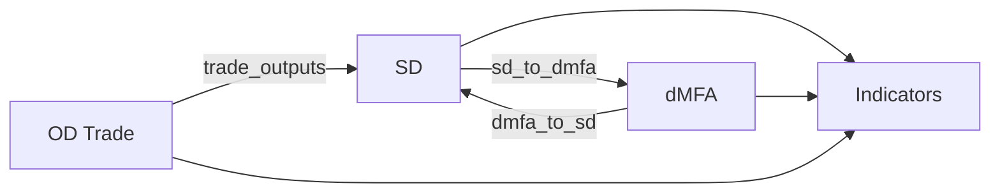
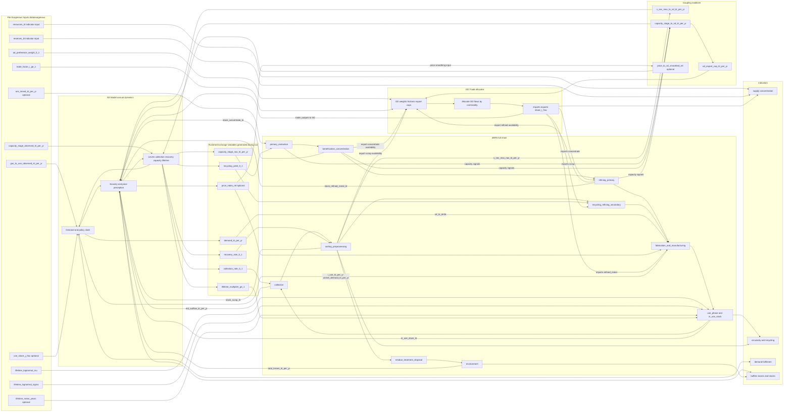
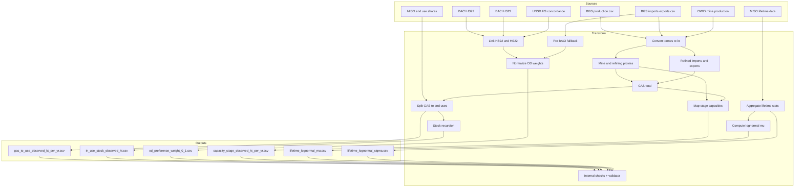

# Workflow Visuals

This page gives a quick visual of:
- the coupled annual model loop,
- the full-chain dMFA scope and SD coupling interactions, and
- the baseline historic exogenous data build pipeline.

## 1) Coupled model annual workflow

Reference file:
- `docs/diagrams/workflow.mmd` (auto-generated from `configs/coupling.yml` via `scripts/generate_mermaid_workflow.py`)

## 1a) Full-chain dMFA scope + SD coupling (detailed)

Reference file:
- `docs/diagrams/coupled_full_chain_scope.mmd`

## 2) Baseline exogenous ETL workflow (historic)

Reference:
- `docs/EXOGENOUS_BASELINE_PROVENANCE.md`

If your Mermaid extension still fails, open the standalone files directly:
- `docs/diagrams/workflow.mmd`
- `docs/diagrams/coupled_full_chain_scope.mmd`
- `docs/diagrams/exogenous_baseline_workflow.mmd`
